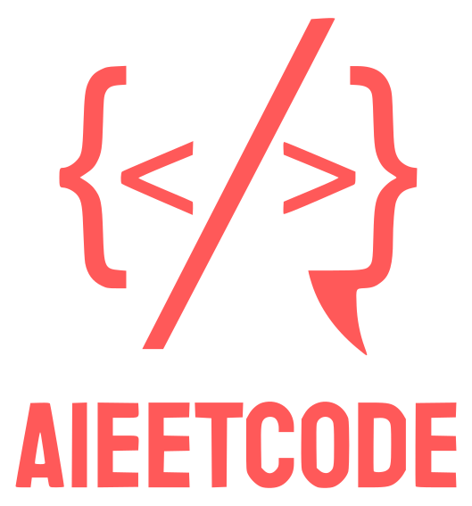

# AieetCode Mastery Roadmap

  

Welcome to the AIeetCode Mastery Roadmap! This repository is designed to help you become a strong software engineer by systematically covering essential topics through curated LeetCode problems.

## Table of Contents

- [Introduction](#introduction)
- [Roadmap Overview](#roadmap-overview)
- [Level 1: Foundations (Easy)](#level-1-foundations-easy)
  - [Week 1: Arrays and Strings](#week-1-arrays-and-strings)
  - [Week 2: Linked Lists](#week-2-linked-lists)
  - [Week 3: Stacks and Queues](#week-3-stacks-and-queues)
  - [Week 4: Basic Tree Traversals](#week-4-basic-tree-traversals)
- [Level 2: Intermediate Concepts (Medium)](#level-2-intermediate-concepts-medium)
  - [Week 5: Hash Tables and Heaps](#week-5-hash-tables-and-heaps)
  - [Week 6: Advanced String Manipulation](#week-6-advanced-string-manipulation)
  - [Week 7: Recursion and Backtracking](#week-7-recursion-and-backtracking)
  - [Week 8: Basic Dynamic Programming](#week-8-basic-dynamic-programming)
- [Level 3: Advanced Topics (Hard)](#level-3-advanced-topics-hard)
  - [Week 9: Graph Algorithms](#week-9-graph-algorithms)
  - [Week 10: Advanced Dynamic Programming](#week-10-advanced-dynamic-programming)
  - [Week 11: Concurrency and Multithreading](#week-11-concurrency-and-multithreading)
  - [Week 12: System Design Basics](#week-12-system-design-basics)
- [Additional Recommendations](#additional-recommendations)
- [Tips for Using This Roadmap](#tips-for-using-this-roadmap)
- [Contributing](#contributing)
- [License](#license)

## Introduction

This roadmap aims to guide you through a structured learning path, covering essential data structures, algorithms, and problem-solving techniques. By following this plan, you'll progressively build your skills without overwhelming jumps in difficulty.

## Roadmap Overview

### Level 1: Foundations (Easy)

#### Week 1: Arrays and Strings

- Topics to Cover:
  - Basic array manipulation
  - String operations
  - Two-pointer technique
- Practice Problems:
  - Two Sum
  - Reverse String
  - Valid Anagram
  - Implement strStr()
  - Best Time to Buy and Sell Stock

#### Week 2: Linked Lists

- Topics to Cover:
  - Singly linked list operations
  - Traversal and basic manipulations
- Practice Problems:
  - Reverse Linked List
  - Merge Two Sorted Lists
  - Linked List Cycle
  - Palindrome Linked List

#### Week 3: Stacks and Queues

- Topics to Cover:
  - Stack implementation using arrays or linked lists
  - Queue operations
- Practice Problems:
  - Valid Parentheses
  - Implement Queue using Stacks
  - Min Stack
  - Binary Tree Level Order Traversal

#### Week 4: Basic Tree Traversals

- Topics to Cover:

  - Binary tree traversals (in-order, pre-order, post-order)
  - Basic tree operations

- Practice Problems:
  - Maximum Depth of Binary Tree
  - Symmetric Tree
  - Path Sum
  - Invert Binary Tree

### Level 2: Intermediate Concepts (Medium)

#### Week 5: Hash Tables and Heaps

- Topics to Cover:
  - Hash map implementations
  - Heap operations and priority queues
- Practice Problems:
  - Top K Frequent Elements
  - Design HashMap
  - Kth Largest Element in an Array
  - Group Anagrams

#### Week 6: Advanced String Manipulation

- Topics to Cover:
  - Sliding window technique
  - Substrings and pattern matching
- Practice Problems:
  - Longest Substring Without Repeating Characters
  - Longest Palindromic Substring
  - Minimum Window Substring
  - Permutation in String

#### Week 7: Recursion and Backtracking

- Topics to Cover:
  - Recursive algorithms
  - Backtracking strategies
- Practice Problems:
  - Permutations
  - Combinations
  - Subsets
  - Word Search

#### Week 8: Basic Dynamic Programming

- Topics to Cover:
  - Memoization
  - Tabulation
- Practice Problems:
  - Climbing Stairs
  - House Robber
  - Coin Change
  - Longest Increasing Subsequence

### Level 3: Advanced Topics (Hard)

#### Week 9: Graph Algorithms

- Topics to Cover:
  - BFS and DFS traversals
  - Topological sorting
  - Union-Find algorithms
- Practice Problems:
  - Number of Islands
  - Course Schedule
  - Redundant Connection
  - Word Ladder

#### Week 10: Advanced Dynamic Programming

- Topics to Cover:
  - Dynamic programming on strings
  - State optimization
- Practice Problems:
  - Edit Distance
  - Wildcard Matching
  - Regular Expression Matching
  - Burst Balloons

#### Week 11: Concurrency and Multithreading

- Topics to Cover:
  - Synchronization mechanisms
  - Deadlock and starvation
- Practice Problems:
  - Print FooBar Alternately
  - Building H2O
  - The Dining Philosophers
  - Traffic Light Controlled Intersection

#### Week 12: System Design Basics

- Topics to Cover:
  - Scalability principles
  - Designing robust systems
- Practice Problems:
  - Design TinyURL
  - Design In-Memory File System
  - Design Search Autocomplete System

## Additional Recommendations

- Testing and Debugging: Practice writing unit tests for your solutions to reinforce good testing habits.
- Security Fundamentals: Read about common vulnerabilities like SQL injection and how to prevent them.
- Database Concepts: Solve some SQL problems to strengthen your understanding of databases.

## Tips for Using This Roadmap

- Consistency: Aim to solve at least one problem a day to build and maintain momentum.
- Understand, Don't Memorize: Focus on understanding the underlying concepts rather than memorizing solutions.
- Reflect: After solving each problem, review your solution and compare it with others to learn different approaches.
- Ask for Help: If you're stuck, don't hesitate to seek hints or explanations to overcome hurdles.

## Contributing

Contributions are welcome! If you have suggestions for additional problems or improvements, feel free to submit a pull request.

## License

This project is licensed under the MIT License.

##

✨ Happy coding and good luck on your journey to becoming a strong software engineer! 🚀💻😊
